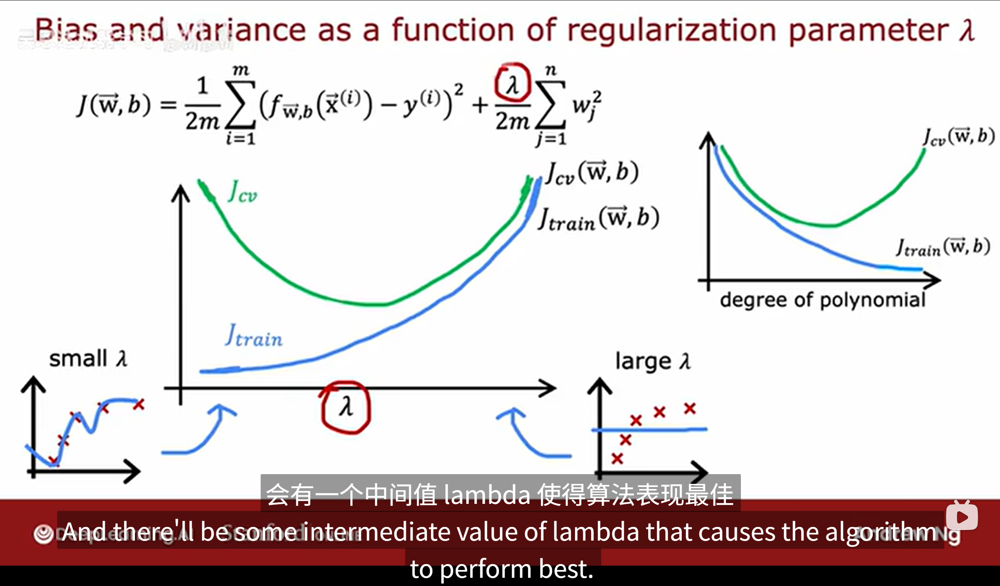
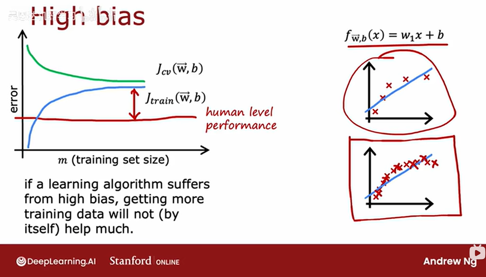

## 神经网络
- 神经元  
   获取输入数字，给出输出数字（激活值），输出可继续作为其他神经元的输入
- 层  
   一层可以有一个或多个神经元，接受上一层的输入向量，为下一层提供输出向量

**某一层的神经元将可以访问输入层中的每一个特征**    


**神经网络所做的是：  
不需要手动设置特征，隐藏层可以自己学习一个更加合适的特征**

多层感知器，拥有多个层的神经网络

## 神经网络中的层
输入层被称为第0层  
使用上标方括号索引某个层，下标索引神经元
$$a_j^{(i)}=g( w_j^{(i)}*a^{(i-1)}+b_j^{(i)} )$$

前向传播：输入x从第0层开始传播到输出层输出y，用于推理，而反向传播可用于**学习**

```python
x=np.array([1,2,3])
layer1=Dense(units=3,activation='sigmoid')
a1=layer1(x)
layer2=Dense(units=1,activation='sigmoid')
a2=layer1(a1)
```
利用tensorflow构建神经网络
```python
import tensorflow
from tensorflow.keras import Sequential
from tensorflow.keras.layers import Dense
x=x=np.array([1,2,3])
y=np.array([1,1,0])

layer1=Dense(units=3,activation='sigmoid')
layer2=Dense(units=1,activation='sigmoid')
model = Sequential ([layer1,layer2])
#or   model = Sequential ([Dense(units=3,activation='sigmoid'),Dense(units=1,activation='sigmoid')])

model.compile(...)
model.fit(x,y)
model.predict(newx)
```

## 前向传播的一般实现
```python
def dense(a_in,W,b,g):
   #a_in输入值
   #W是各个神经元参数的堆叠，每个列向量表示一个神经元中的参数
   #b是各个神经元偏置的堆叠，每一列表示一个神经元的偏置
   a_out=a_in @ W +b
   return g(a_out)

def sequntial(x):
   a1=dense(x,W1,b1,g)
   a2=dense(a1,W2,b2,g)
   a3=dense(a2,W3,b3,g)
   return a3
```

## 训练神经网络
- 第一步 架构神经网络及选择合适的计算模型  
   model = Sequential([])
- 第二步 确定损失函数  
   model.compile(loss=)
- 第三步 最小化损失函数  
   model.fit(X,y,epoches=1000)
```python
import tensorflow
from tensorflow.keras import Sequential
from tensorflow.keras.layers import Dense
model = Sequential ([Dense(units=3,activation='sigmoid'),Dense(units=1,activation='sigmoid')])

from tensorflow.keras.losses import BinaryCrossentropy
#二元交叉熵损失函数，适用于二分类问题，实际上与逻辑回归的损失函数相同
model.compile(loss= BinaryCrossentropy() )
#MeanSquaredError() 平方误差损失函数

model.fit(X,y,epoches=1000)
#fit函数通过反向传播来计算偏导数项，因此不需要手动计算
```

### sigmoid的替代函数
- ReLU函数(校正线性单元)  
   g(z)=max( 0 , z )
- 线性激活函数
   g(z)= z

二进制分类问题 sigmoid  
有正负的回归问题可以用 linear（只使用线性回归函数将只能拟合线性回归模型，失去非线性能力）    
无负数的回归 ReLU  

**RELU最常见的激活函数**
- 计算效率高
- 只在一个地方变平，变平会减慢学习速度


## 多类
### softmax回归
$$z_j = w_j x + b_j $$
$$a_i = exp(z_i) / sigma(exp)$$
**使用exp函数可以强化高置信度预测，放大差异，同时避免非负值的出现，利于归一化**


**损失函数**
$$\[
L(\mathbf{W}, \mathbf{b}) = -\log p_c
\]$$
其中yc指正确标签的a_c值，只计算正确的那个
### softmax在神经网络中的实现

```python
import tensorflow
from tensorflow.keras import Sequential
from tensorflow.keras.layers import Dense
model = Sequential ([Dense(units=10,activation='relu'),Dense(units=25,activation='relu'),Dense(units=25,activation='linear')])

from tensorflow.keras.losses import SparseCatogoricalCrossentropy
#稀疏分类交叉熵损失函数 稀疏指每个样本只对应一个类别标签
model.compile(loss= SparseCatogoricalCrossentropy(from_logits=true) )#from_logits=true指将输出层中的原始分数直接调用，防止中间值带来的舍入误差

model.fit(X,y,epoches=1000)
```

### 多标签分类问题
多标签区分于多类别，同一个样本可以对应多个标签，输出可以是一个向量

### adam算法
为每个不同的参数提供不同的学习率，且如果函数在某个参数的变动上相近就增大学习率，而发散则减小学习率
```tensorflow
model.compile(optimizer.tf.keras.optimizers.Adam(learning_rate=1e-3))
```

### 神经层种类
dense 密集层 将上一层的所有激活作为输入
convolutional layer 卷积层，每个单元只查看有限输入窗口
- 提升计算效率，不易过拟合，需要更少的训练数据


### 模型评估

**优化模型方式**  
1. 增大数据集（对高方差有用，对高偏差几乎无用）
2. 调整特征
3. 增加高次项
4. 调整正则化系数  

将数据分为训练集和测试集，用训练集训练模型，再用该模型分别计算测试集和训练集的平均平方成本误差或二元交叉熵误差（无正则化项），比较得知泛化能力  

$$ J(w,b) test = \frac{1}{2m(test)} \sum_{i=1}^{n} (y^{(i)} - \hat{y}^{(i)})^2 $$   
$$ J(w,b) train = \frac{1}{2m(train)} \sum_{i=1}^{n} (y^{(i)} - \hat{y}^{(i)})^2 $$ 

*注意所有模型评估测试中都不含有正则化项，正则化项只在训练中出现*  
逻辑回归中另一种评估模型时计算损失的方法是计算错误分类的比例  

注意评估模型时既要评估测试集也要评估训练集

**选择模型和跟评估各模型的方法**  
*注意所有模型评估测试中都不含有正则化项，正则化项只在训练中出现*   

1. 确定备选模型
   
2. 将数据分为，训练集，交叉验证集和测试集（交叉验证集实际上是代替测试集选择模型，确保模型的选择和测试集完全无关，避免乐观的泛化估计）  

3. 训练集为各个模型训练出适合该模型的参数  

4. 通过验证集来选出看起来拟合程度最好的模型  

5. 再使用测试集来测试上一步中选择出的模型的泛化能力  

### 高偏差与高方差
- 高偏差（欠拟合）  J(train)很大，J(cv)约等于J(train)
- 高方差（过拟合）  J(cv)>>J(train),J(train)可能很小
- 同时出现高偏差与高方差   J(train)很大，J(cv)>>J(train)  

**高次幂对偏差和方差的影响**
- 多项式的最高次幂越小则J(train)越大，最高次幂越大则J(train)会越低，J(train)随最高次幂的增大而减小
- 多项式的最高次幂很低或者很高则J(cv)都会很高，但取中间值会最小（该值不一定最合适，只是单独适合这个测试集的偏好）

**正则化系数对偏差和方差的影响**
- J(train)随正则化系数的增大而增大
- 正则化系数很低或者很高则J(cv)都会很高，但取中间值会最小（该值不一定最合适，只是单独适合这个测试集的偏好）

```python
layer1=Dense(units=25,activation="relu",kernel_regularizer=L2(0.01))
```



**训练集大小对Jtrain和Jcv的影响**  
- J(train)随训练集大小的增大而增大  
- J(cv)随训练集大小的增大而减小
增加训练集的大小并不会对高偏差模型有任何影响，模型太简单了
但增加训练集的大小可能会对高方差模型有帮助，可以使该模型不至于过度拟合
  

### 高偏差方差与神经网络
一个更大的神经网络事实上经过良好的正则化后依然可以表现得很好，但需要大量的训练数据  

在训练集表现不好->更大的神经网络  

在验证集表现不好->更多的数据 

### 机器学习的迭代循环
架构模型（确定模型大小，函数，确定起始特征，调整正则化系数等），训练模型，误差诊断（高偏差和高方差）  三者循环  

### 错误分析  
通过手动检查算法错误示例激发有用的方法  

### 增加数据
1. 最普遍的增加各类数据
2. 通过错误分析寻找特定数据子集，显著提高性能
3. 数据增强
   - 改变一个现存训练例来创建一个新的训练例
4. 数据合成
   - 从零开始创造新数据
  
### 迁移学习
首先在大型数据集上训练（有监督预训练），在小型数据集上进行微调
- 选项一 将前几层的数值直接复制，最后一层重新训练（适用于新数据集较小）
- 选项二 重新训练所有数值，但将前几层的数据作为初始化的值（适用于新数据集中等）

### 建立表现基准   
- 确定基线水平  
   通过人类表现，竞争算法，经验猜测等方式来评估损失函数的实际影响

### 机器学习项目的完整周期
1. 确定project
2. 收集数据
3. 训练模型（训练，误差分析，错误分析，迭代循环）
4. 生产部署

### 倾斜数据集
真正例（预测为正且真实）  
真负例（预测为负且真实）  
假正例（预测为正但错误） 
假负例（预测为负但错误） 

- 精确率（表示机器判定该例时该判定有多大的可能正确）
  真正例/预测正例（真正例/（真正例+假正例））
- 召回率（表示该例应当被判定时机器有多大可能判定出来）
  真正例/真实正例（真正例/（真正例+假负例））

提高阈值->提高精确率却降低召回率  
降低阈值->降低精确率却提高召回率  

结合精准率和召回率的方法：  
F1分数（调和平均值）  
F1 = 2* pre *rec / (pre+rec)  
F1分数放大较小值对结果的影响
### 决策树模型
从根节点出发，通过判断来走向不同的叶节点   

**建立决策树**  
1. 查看所有训练样本，选择区分特征（尽量选择区分后可获得高纯度集的特征）  
2. 何时停止划分（当一个节点绝对同类，时间或深度超出参数限制，纯度得分低于阈值，集合中样本数低于阈值）

### 测量纯度
注意计算测量纯度是以最终问题为导向的，不是分裂问题或其他  

测量纯度：  
$$p=n(ex)/n(all)$$  

墒函数：  
$$H(X) = -[p * log_2 p + (1-p) * log_2 (1-p)]$$  

p为0.5时熵最大

### 选择分裂
计算加权平均熵
$$H=sigma[n(该集合)/n(all) * H(此集合)]$$  
根节点熵 减 该加权平均熵得到信息增益
信息增益衡量该分支方法所减熵的效果  

$$信息增益 = H(p_{root}) - w(left)H(p_{left})-w(right)H(p_{right})$$  
**建立过程**  

1. 查看所有训练样本
2. 根据信息增益选择区分特征
3. 重复该步骤直到  （当一个节点100%为最终问题同类，时间或深度超出参数限制，信息增益低于阈值，集合中样本数低于阈值）

### 独热编码
把一个有多个离散的目标类别的多叉树问题转化成多个二叉树问题

### 连续的有价值特征
当牟哥特征连续时，可以选择取一个中间值来分开子集，同样使用信息增益来获得反馈

### 回归树
当需要解决回归预测问题时使用  
此时的信息增益为  
$$信息增益 = Z_root - w(left)Z_left-w(right)Z_right$$  
Z为方差
```
def population_variance(data):
    """计算总体方差"""
    n = len(data)
    mean = np.mean(data)
    return sum((x - mean) ** 2 for x in data) / n
```
